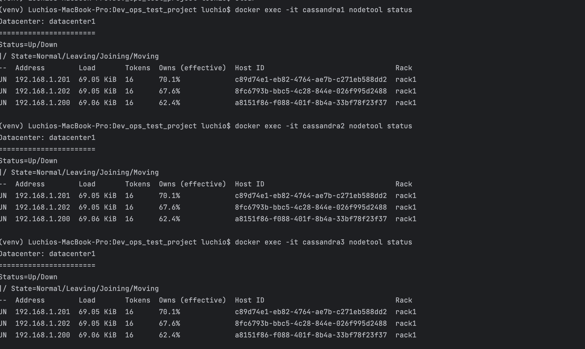
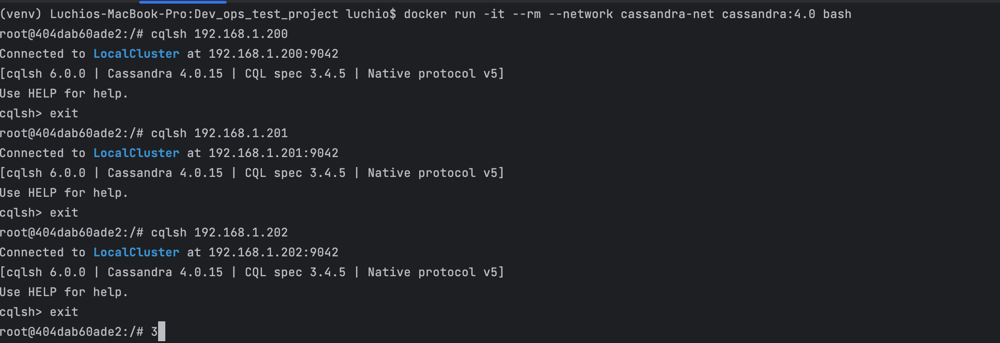

# Развёртывание кластера Cassandra с помощью Docker Compose

Этот проект развертывает кластер Cassandra из трёх инстансов, каждый из которых доступен по своему IP-адресу в локальной сети. Кластеры можно тестировать и подключаться к ним с любой другой машины в той же сети.

---

## Требования

- **Docker**: версия 24.02 и выше.
- **Docker Compose**: версия 2.19.1 и выше.
- Локальная сеть с доступными IP-адресами: 192.168.1.200–192.168.1.202.

---

## Шаги установки

### 1. Создание внешней сети

Для настройки фиксированных IP-адресов создаём пользовательскую сеть в Docker:

```bash
docker network create --subnet=192.168.1.0/24 cassandra-net
```
---

### 2. Запуск кластера

В директории с файлом docker-compose.yml выполните команду:

```bash
docker-compose up -d
```
---
После запуска убедитесь, что все три узла работают:
```bash
docker exec -it cassandra1 nodetool status
```
---
### Скриншот примера работы


---
## Подключение к Cassandra
```bash
docker run -it --rm --network cassandra-net cassandra:4.0 bash
```

Используйте cqlsh для подключения к каждому узлу:

```bash
cqlsh 192.168.1.200
cqlsh 192.168.1.201
cqlsh 192.168.1.202
```
---

Убедитесь, что соединение успешно установлено. 

### Пример успешного подключения:


---

## Примечания
 - Используйте фиксированные IP-адреса только для локального тестирования.
 - В продуктивной среде рекомендуется использовать динамические IP с DNS для упрощения управления.

---